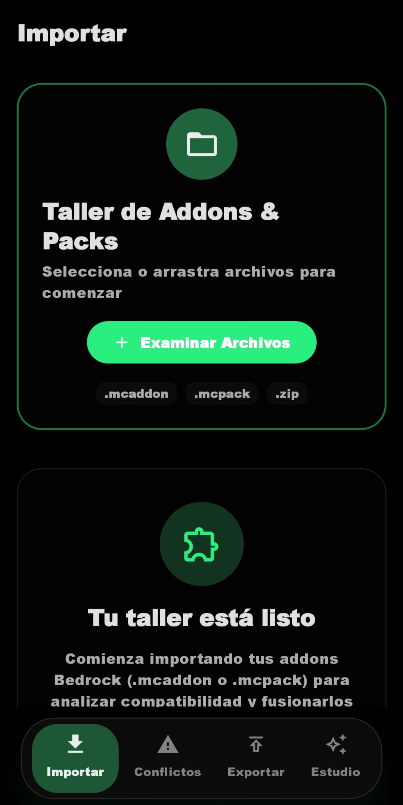
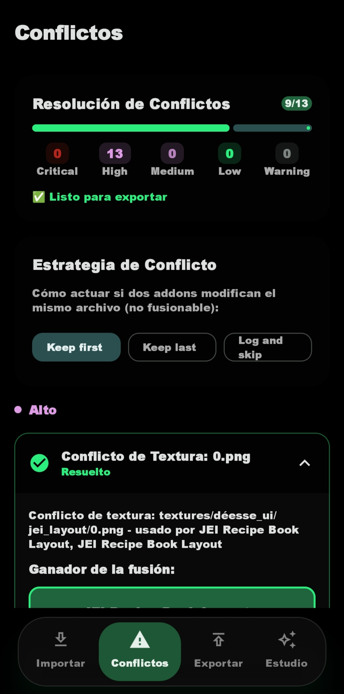
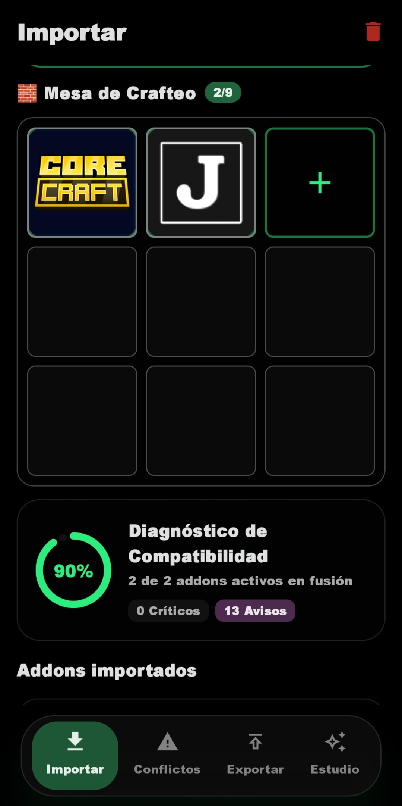
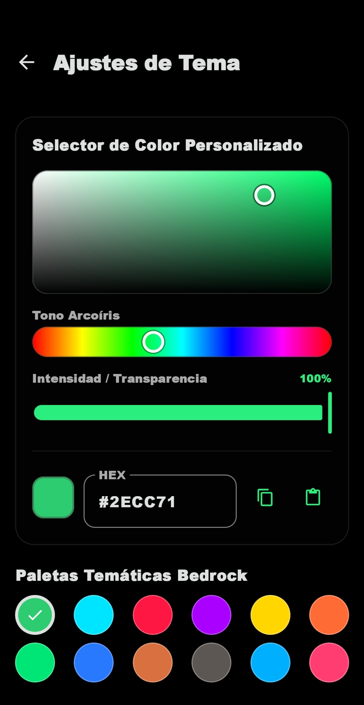
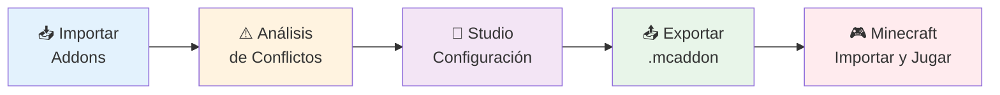

# ⚒️ PackForge

> **Fusiona múltiples addons de Minecraft Bedrock Edition en un solo modpack funcional** — sin texturas rotas, sin conflictos manuales, sin dolores de cabeza.
> WEBSITE: https://packforge.netlify.app/

<div align="center">

[](https://kotlinlang.org/)
[](https://www.android.com/)
[](https://developer.android.com/jetpack/compose)
[](https://github.com/Lord4rk2028/PackForge/actions)
[](LICENSE)

</div>

---

## 📱 Vista Previa

<table align="center" border="0">
  <tr>
    <td align="center" valign="top">
      <br/>
      <sub><b>Importar Addons</b></sub><br/>
      <sub>Selector de archivos .mcaddon/.zip</sub>
    </td>
    <td align="center" valign="top">
      <br/>
      <sub><b>Conflictos</b></sub><br/>
      <sub>Detección y resolución automática</sub>
    </td>
    <td align="center" valign="top">
      <br/>
      <sub><b>Studio</b></sub><br/>
      <sub>Gestión de fuentes Bedrock</sub>
    </td>
    <td align="center" valign="top">
      <br/>
      <sub><b>Temas</b></sub><br/>
      <sub>Oscuro/Claro + Colores</sub>
    </td>
  </tr>
  <tr>
    <td align="center" colspan="4">
      <em>De izquierda a derecha: Importación de addons → Detección de conflictos → Studio de gestión → Personalización de interfaz</em>
    </td>
  </tr>
</table>

## 🧩 ¿Qué hace?

| Función | Descripción |
|---------|-------------|
| 📦 **Importación múltiple** | Selecciona varios addons (`.mcaddon` / `.zip`) simultáneamente |
| 🔀 **Fusión real** | Combina bloques, ítems, texturas, sonidos, recetas, entidades y scripts |
| ⚠️ **Detección de conflictos** | Identifica y resuelve colisiones de IDs, texturas y scripts automáticamente |
| 📤 **Exportación limpia** | Genera un único `.mcaddon` listo para importar en Minecraft |

## 🎯 ¿Por qué PackForge?

Fusionar addons manualmente requiere:
- ✏️ Editar múltiples `manifest.json`
- 🔢 Resolver IDs duplicados a mano
- 🧩 Unir archivos JSON sin romper sintaxis
- 🔗 Vincular behavior packs con resource packs

**Un solo error = Minecraft rechaza el paquete o crashea.** PackForge automatiza todo el proceso con un motor de fusión inteligente.

---

## 🚀 Características Principales

### 🔧 Motor de Fusión

| Componente | Función |
|------------|---------|
| `AddonExtractor` | Desempaqueta `.mcaddon`/.zip con validación de seguridad |
| `ConflictEngine` | Detecta y resuelve colisiones de IDs, texturas y scripts |
| `IdentifierRemapper` | Renombra IDs duplicados manteniendo referencias intactas |
| `JsonDeepMerger` | Fusión profunda de manifests y archivos JSON |
| `ManifestGenerator` | Crea manifests válidos y enlaza behavior + resource packs |
| `BedrockCompatibilityAnalyzer` | Evalúa compatibilidad de versiones y formatos |
| `EntityDependencyResolver` | Mantiene coherencia entre entidades y spawn rules |
| `FastModpackExporter` | Exporta el `.mcaddon` final optimizado |

### 🌟 Funcionalidades de Usuario

- 🔍 **Búsqueda integrada** — Explora Modrinth, MCPEDL y CurseForge desde la app
- 📂 **Gestor de archivos** — Abre `.mcaddon` y `.mcpack` directamente desde el explorador
- ✅ **Verificación de Minecraft** — Detecta si tienes Bedrock Edition instalado
- 💾 **Persistencia local** — Room para guardar modpacks y DataStore para preferencias
- 🎨 **UI personalizable** — Temas claro/oscuro con selección de colores Material 3

---

## 🧪 Flujo de Uso



**Pasos detallados:**

| # | Paso | Acción |
|---|------|--------|
| 1 | **Importar** | Selecciona múltiples `.mcaddon` o `.zip` desde tu dispositivo |
| 2 | **Analizar** | La app detecta automáticamente conflictos entre addons |
| 3 | **Studio** | Configura nombre, autor, versión y portada del modpack |
| 4 | **Exportar** | Genera un único `.mcaddon` optimizado y listo para usar |
| 5 | **Jugar** | Abre con Minecraft Bedrock e importa el resultado |

---

## 📲 Instalación

### 🔽 Opción Rápida — APK de CI
[](https://github.com/Lord4rk2028/PackForge/actions)

Descarga la última versión de depuración directamente desde los **artefactos** del workflow [Android CI](https://github.com/Lord4rk2028/PackForge/actions).

### 🛠️ Compilar desde Código Fuente

<details>
<summary><b>Requisitos previos (clic para expandir)</b></summary>

- **JDK 17** o superior
- **Android SDK** con API 35 (compile/target SDK)
- **Git** instalado

</details>

```bash
# 1. Clonar el repositorio
git clone https://github.com/Lord4rk2028/PackForge.git
cd PackForge

# 2. Dar permisos al script de Gradle
chmod +x gradlew

# 3. Compilar APK de depuración
./gradlew assembleDebug

# ✅ APK generado en: app/build/outputs/apk/debug/app-debug.apk
```

### 🧪 Ejecutar Tests

```bash
# Tests unitarios del motor de fusión
./gradlew test

# Build completo con verificación
./gradlew build
```

---

## 📋 Requisitos del Sistema

| Componente | Requisito | Notas |
|------------|-----------|-------|
| 📱 **SO** | Android 8.0+ (API 26) | Probado hasta Android 15 |
| 🎮 **Juego** | Minecraft Bedrock Edition | Necesario para importar modpacks |
| 📦 **Addons** | Formato estándar Bedrock | Deben incluir `manifest.json` válido |
| 💾 **Almacenamiento** | ~50 MB libres | Para la app + modpacks temporales |

---

## 🛠️ Stack Tecnológico

<div align="center">

| Categoría | Tecnologías |
|-----------|-------------|
| **Lenguaje** |  |
| **UI Framework** | Jetpack Compose (BOM 2025) + Material 3 Expressive 1.4.0 |
| **Arquitectura** | MVVM + Clean Architecture (`domain` / `data` / `ui`) |
| **Persistencia** | Room 2.8.4 (KSP) + DataStore Preferences |
| **Networking** | Retrofit 2.11 + OkHttp 4.12 + Gson |
| **Imágenes** | Coil 2.6.0 |
| **Navegación** | Navigation Compose 2.8.5 |
| **Build** | Gradle 9.3.1 + KSP, SDK 35 |
| **CI/CD** | GitHub Actions |

</div>

---

## 🗂️ Estructura del Proyecto

```
app/src/main/java/com/packforge/app/
│
├── 📱 MainActivity.kt
├── 🏛️ PackForgeApplication.kt
│
├── domain/                          # 🧠 Lógica de negocio (Motor de fusión)
│   ├── engine/
│   │   ├── AddonExtractor.kt            # Desempaqueta .mcaddon/.zip
│   │   ├── AddonParser.kt / AddonMerger.kt
│   │   ├── ConflictEngine.kt            # ⚠️ Detección de conflictos
│   │   ├── IdentifierRemapper.kt        # 🔀 Remapeo de IDs
│   │   ├── JsonDeepMerger.kt            # 🧩 Fusión JSON profunda
│   │   ├── ManifestGenerator.kt         # 📄 Manifests válidos
│   │   ├── BedrockCompatibilityAnalyzer.kt
│   │   ├── EntityDependencyResolver.kt
│   │   ├── ScriptCollisionAnalyzer.kt
│   │   └── FastModpackExporter.kt       # 📤 Exportación final
│   │
│   └── model/                       # Modelos de dominio
│       ├── Addon.kt
│       ├── Conflict.kt
│       ├── MergeResult.kt
│       └── ExportState.kt
│
├── data/                            # 💾 Capa de datos
│   ├── PackForgeDatabase.kt
│   ├── SavedModpackDao.kt
│   ├── ThemePreferences.kt
│   └── modrinth/                    # API Modrinth client
│
├── ui/                              # 🎨 Interfaz de usuario
│   ├── screens/
│   │   ├── ImportScreen.kt
│   │   ├── StudioScreen.kt
│   │   ├── ConflictsScreen.kt
│   │   ├── ExportScreen.kt
│   │   ├── CoverPickerScreen.kt
│   │   ├── ModrinthSearchScreen.kt
│   │   ├── McpedlSearchScreen.kt
│   │   ├── ThemeSettingsScreen.kt
│   │   └── WebBrowserScreen.kt
│   ├── navigation/                  # Navegación
│   ├── components/                  # Componentes reutilizables
│   ├── theme/                       # Material 3 theming
│   └── viewmodel/                   # ViewModels
│
└── util/                            # 🛠️ Utilidades
    ├── FileUtils.kt
    ├── PackForgeLog.kt
    └── PackForgeConfig.kt
```

---

## 🗺️ Roadmap

<div align="center">

| Prioridad | Funcionalidad | Estado |
|-----------|--------------|--------|
| 🔴 Alta | Editor manual de conflictos (UI interactiva) | 📝 Planeado |
| 🟡 Media | Modos de fusión configurables | 💭 En discusión |
| 🟢 Baja | Soporte multi-formato avanzado | 💭 En discusión |
| 🟢 Baja | Notificaciones en segundo plano | 📝 Planeado |
| 🟢 Baja | Publicación en Google Play | 💭 En discusión |
| 🟢 Baja | Tests de regresión del motor | 🔄 En progreso |

</div>

**Próximamente:**
- ✨ Selector visual para decidir qué addon "gana" en conflictos
- ⚙️ Perfiles de fusión predefinidos (rápido, seguro, personalizado)
- 📊 Historial de exportaciones y estadísticas de uso

---

## 🤝 Contribuir

¡Las contribuciones son bienvenidas! Sigue estos pasos:

```bash
# 1. Fork del repositorio
# 2. Clona tu fork
git clone https://github.com/TU_USUARIO/PackForge.git

# 3. Crea una rama para tu feature
git checkout -b feat/mi-mejora

# 4. Realiza tus cambios y añade tests (si toca domain/engine)
# 5. Ejecuta los tests
./gradlew test

# 6. Commit y push
git commit -m "feat: descripción de tu mejora"
git push origin feat/mi-mejora

# 7. Abre un Pull Request a la rama main
```

### 📋 Guía rápida para PRs

| Tipo | Descripción | Ejemplo |
|------|-------------|---------|
| `feat:` | Nueva funcionalidad | `feat: editor visual de conflictos` |
| `fix:` | Corrección de bugs | `fix: crash al exportar modpacks grandes` |
| `docs:` | Cambios en documentación | `docs: mejorar README` |
| `refactor:` | Refactorización de código | `refactor: optimizar ConflictEngine` |
| `test:` | Añadir/modificar tests | `test: tests para JsonDeepMerger` |

---

## 📄 Licencia

Este proyecto está licenciado bajo la **MIT License** — consulta el archivo [`LICENSE`](LICENSE) para más detalles.

En resumen: puedes usar, modificar y distribuir el código libremente, incluso con fines comerciales, manteniendo el aviso de copyright original.

---

## ⚠️ Notas Importantes

> 🔒 **Seguridad**: PackForge **no modifica el contenido creativo** de los addons originales, solo los combina técnicamente.

> ⚠️ **Compatibilidad**: Si dos addons son fundamentalmente incompatibles (versiones de Minecraft distintas, scripts conflictivos), la fusión puede generar advertencias. **Revisa siempre el reporte de conflictos antes de jugar.**

> 🚧 **Estado**: Proyecto en **desarrollo activo**; puede tener errores o casos de addons aún no soportados. ¡Reporta issues si encuentras problemas!

---

<div align="center">

### 📊 Estado del Proyecto

[](https://github.com/Lord4rk2028/PackForge/stargazers)
[](https://github.com/Lord4rk2028/PackForge/network/members)
[](https://github.com/Lord4rk2028/PackForge/issues)
[](https://github.com/Lord4rk2028/PackForge/commits/main)

---

**⚖️ Licencia:** [MIT](LICENSE) — Usa, modifica y distribuye libremente manteniendo el copyright original.

**🎮 ¿Tienes dudas?** Abre un [issue](https://github.com/Lord4rk2028/PackForge/issues) o únete a las discusiones.

---

<p align="center">
  <sub>Hecho con ❤️ para la comunidad de Minecraft Bedrock</sub><br/>
  <sub>Proyecto no afiliado a Mojang ni a Microsoft. Minecraft es una marca registrada de Mojang Synergies AB / Microsoft.</sub>
</p>

</div>
